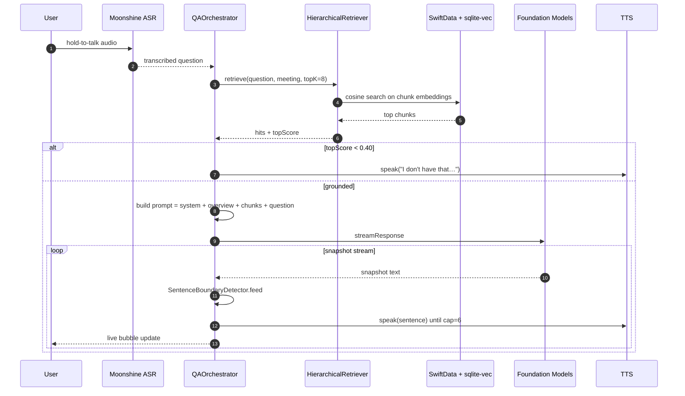
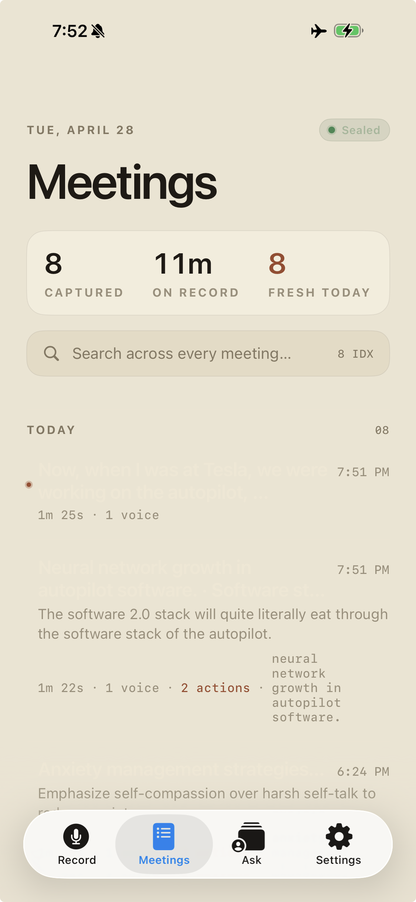
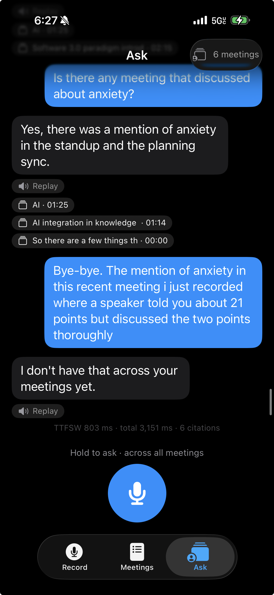
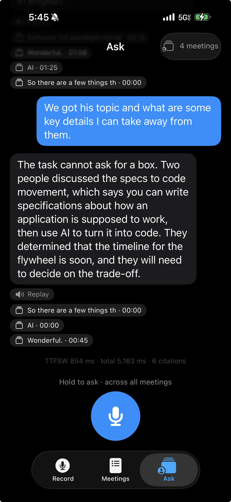
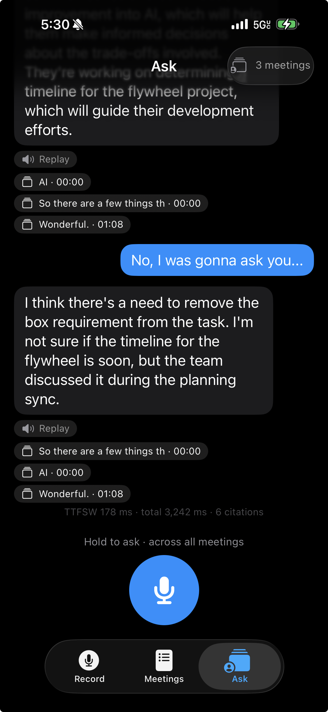

# Aftertalk

> Your meeting, captured and conversational. Fully offline. Nothing leaves the device.

A personal experiment in fully on-device meeting intelligence for iOS 26+. Records a meeting in airplane mode, transcribes locally, generates a structured summary, and lets you ask follow-up questions by voice — every model runs on the iPhone's Neural Engine, no network, no cloud. MIT licensed.

## Status (Day 5 of 7)

End-to-end loop is live on hardware: record → on-device transcript → diarized structured summary → hold-to-talk **or** push-to-talk voice Q&A with neural TTS, grounded streaming answers, citations, and cross-meeting global chat. Measured on iPhone Air: **TTFT 104 ms, total Q&A turn 1,440 ms.** UI shipped to the Quiet Studio editorial spec — Onboarding, Record, Meetings, Detail (Summary/Transcript/Actions tabs), Ask, Global Ask, Settings (live privacy audit).

| Layer | Pick | Notes |
|---|---|---|
| ASR (streaming) | Moonshine **medium-streaming-en** (245M, 6.65% WER, 303 MB) | Beats Whisper Large v3 on WER at a fraction of the size |
| ASR (post-recording polish) | FluidAudio **Parakeet TDT 0.6B v2** | Lazy-warm Core ML; falls through if weights unbundled |
| Diarization | FluidAudio **Pyannote 3.1 + WeSpeaker v2** | Runs in parallel with Parakeet via async-let; segments persist with the meeting |
| LLM | Apple **Foundation Models** (iOS 26) | 4096-token cap, ~30 tok/s on A18; map-reduce for long meetings |
| Embeddings | gte-small Core ML, 384-dim (NLContextual fallback) | ~6 MB |
| Vector store | SwiftData + sqlite-vec | One SQLite file, MATCH joins back to typed rows |
| Summary | `@Generable MeetingSummary` (decisions / actions / topics / openQs) | Speaker context injected into system prompt for attribution |
| Retriever | Hierarchical 3-layer (summary → chunk → ContextPacker) | Grounding gate at cosine 0.40; 2,400-token budget |
| Q&A | `QAOrchestrator` — retrieve → snapshot stream → sentence detector → TTS prefetch | Per-meeting + global chat threads, citations carry speaker IDs |
| TTS | FluidAudio **Kokoro 82M ANE** (24 kHz Float32, AVAudioConverter to 48 kHz) | Lazy-warmed on first chat open to keep iPhone Air under jetsam ceiling |
| Barge-in | Mic stays armed during TTS; tap-to-stop + auto-rearm window | TEN-VAD swap documented for Day 6 if energy heuristics regress |

## Architecture


### Q&A turn — sequence



### Component layout


## UI gallery

| Meetings (today) | Settings (live audit) | Ask (across meetings) |
|---|---|---|
|  |  |  |

| Ask — citation pills | Ask — follow-up turns |
|---|---|
|  |  |

## Day-by-day shipped

**Day 0 — Bootstrap.** Xcode project, SPM dependencies, PRD + architecture docs, daily briefs, repo to GitHub.

**Day 1 — Live ASR.** AVAudioEngine 48 → 16 kHz capture, Moonshine streaming wrapper with single-warm + per-utterance start/stop, debug overlay surfacing TTFT and event counters.

**Day 2 — Summary + RAG.** SwiftData model (Meeting, TranscriptChunk, SpeakerLabel, MeetingSummaryRecord). gte-small Core ML embedding service. sqlite-vec vector store. `@Generable MeetingSummary` over Foundation Models. Chunker with 30 s windows.

**Day 3 — Voice Q&A loop.** Hold-to-talk Moonshine question ASR. Hierarchical retriever. ContextPacker with explicit 2,400-token budget. Grounding gate at cosine 0.40. QAOrchestrator with snapshot streaming → SentenceBoundaryDetector → TTS prefetch. Per-meeting chat thread (ChatThread + ChatMessage). Map-reduce summarization for long meetings (>7,500 chars). Moonshine swap to medium-streaming for 1.2 pp WER improvement.

**Day 4 — Neural TTS + diarization.** FluidAudio Kokoro 82M ANE wired through `TTSWorker` actor with sentence-boundary streaming and 24 kHz → speaker `AVAudioConverter` bridge. FluidAudio Pyannote 3.1 + WeSpeaker v2 integrated; `DiarizationReconciler` aligns word-timing with speaker segments so transcript chunks and summary attribute ownership. Lazy-warm pattern keeps iPhone Air below the iOS 26 jetsam ceiling.

**Day 5 — Quiet Studio refactor + cross-meeting + Settings audit.** Full editorial UI pass against the QS handoff: shared `QSEyebrow / QSTitle / QSBody / QSPrivacyBadge / QSPrimaryButton / QSDivider / BreathingOrb / ImmersiveWaveform` primitives, light/dark palette, `\.atPalette` env-key. OnboardingFlow (3-screen privacy gate). RecordButton + immersive waveform record screen. ProcessingView with breathing orb + ordered model steps. MeetingsListView editorial layout. MeetingDetailView with Summary/Transcript/Actions tab strip. ChatThreadView with replay + citation pills. GlobalChatView cross-meeting thread (ChatThread.isGlobal). HierarchicalRetriever Layer 1 (summary search) + Layer 2 (chunk scoping). SettingsView privacy manifesto with live `@Query` audit counts, `ModelLocator` filesystem probes, `PrivacyMonitor.state` subtitles, Verify button state machine. Grounding gate widened so newly-recorded meetings surface in global Ask. UI hardening pass — hardcoded ink/faint colors on NavigationLink labels and AuditRow text where SwiftUI's button-tint inheritance was washing them out.

## Privacy

Three layers of audit:

1. **Static** — `git grep -n "URLSession\|URLRequest\|http://\|https://" Aftertalk/` returns zero in production paths.
2. **Runtime** — `NWPathMonitor` assertion fires if any interface is up while recording.
3. **Visual** — airplane badge in app chrome turns green only when all interfaces are down.

## Build

```bash
git clone https://github.com/theaayushstha1/aftertalk
cd aftertalk
xcodegen generate
open Aftertalk.xcodeproj
# Plug in iPhone, select as destination, Cmd+R.
```

Models (Moonshine `.ort` files, ~303 MB) are gitignored; populate `Aftertalk/Models/moonshine-medium-streaming-en/` per `Aftertalk/Models/README.md`.

Requirements: Xcode 17+, iOS 26+ device, Apple Developer signing.

## Roadmap

- [x] Day 0 — Bootstrap
- [x] Day 1 — Streaming ASR on device
- [x] Day 2 — Summary + RAG
- [x] Day 3 — Voice Q&A loop with grounding gate
- [x] Day 4 — Pyannote diarization + Kokoro neural TTS
- [x] Day 5 — Quiet Studio UI + cross-meeting global chat + Settings privacy audit
- [ ] Day 6 — Custom QS tab bar + center record FAB, MetricKit profiling, edge cases
- [ ] Day 7 — Demo video + submission

## Acknowledgments

Moonshine ASR — Useful Sensors. FluidAudio — Fluid Inference. gte-small — Alibaba DAMO. sqlite-vec — Alex Garcia.

## License

MIT
