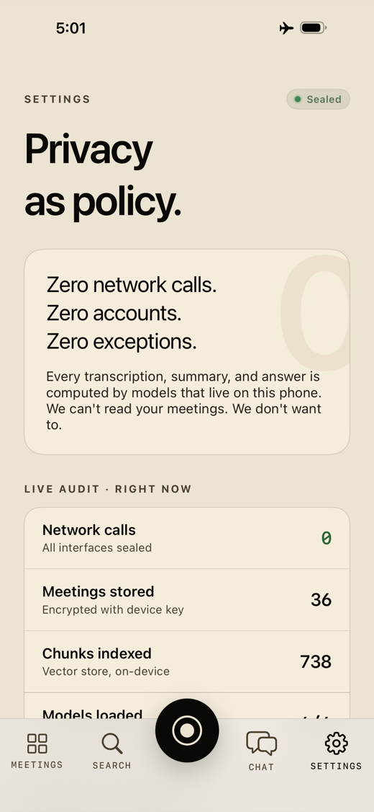
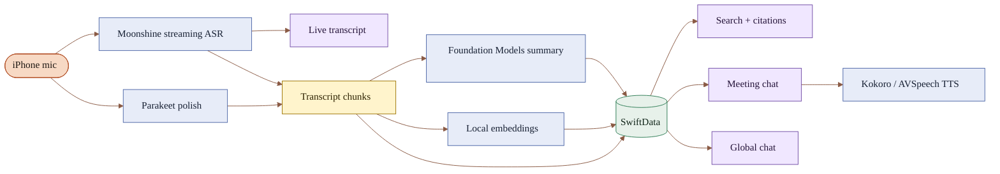
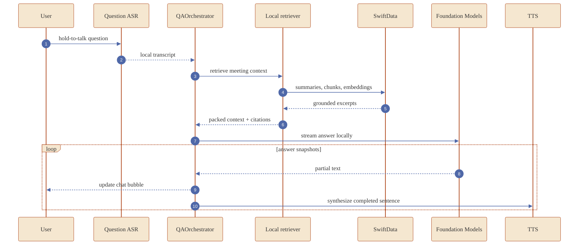
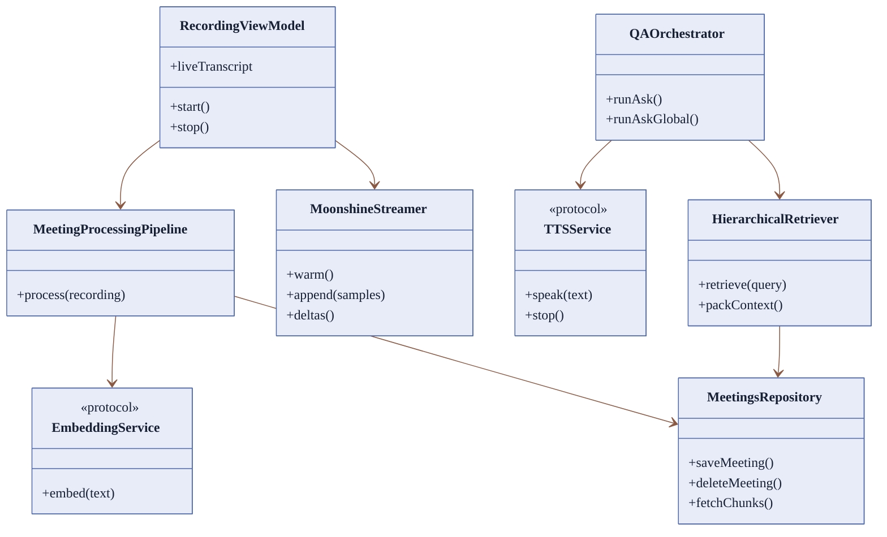
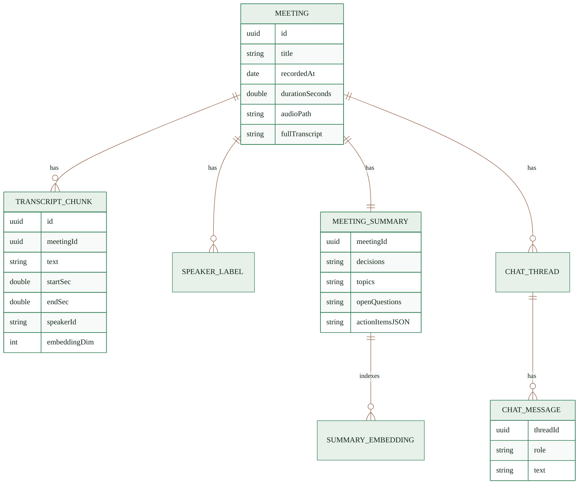

# Aftertalk

Private meeting intelligence for iPhone. Record a conversation, get a live transcript, structured notes, searchable history, and voice Q&A with citations. Audio, text, embeddings, summaries, and questions stay on device.

<p align="center">
  
</p>

<p align="center">
  <kbd>iOS 26+</kbd>
  <kbd>SwiftUI</kbd>
  <kbd>Foundation Models</kbd>
  <kbd>Moonshine ASR</kbd>
  <kbd>FluidAudio</kbd>
  <kbd>Local-first</kbd>
</p>

## What It Does

| Capture | Understand | Ask |
|---|---|---|
| Live on-device transcription with Moonshine streaming ASR. | Local summaries, action items, topics, transcript chunks, and speaker-attributed excerpts. | Per-meeting and cross-meeting chat grounded in saved meeting context. |
| Post-recording polish with Parakeet when model assets are bundled. | SwiftData storage plus local embeddings for semantic recall. | Streaming answers with citations and optional local neural TTS. |

## Product Tour

<table>
  <tr>
    <td align="center"><br><b>Live recording</b></td>
    <td align="center"><br><b>Meeting memory</b></td>
    <td align="center"><br><b>Structured summary</b></td>
  </tr>
  <tr>
    <td align="center"><br><b>Transcript</b></td>
    <td align="center"><br><b>Action items</b></td>
    <td align="center"><br><b>Ask this meeting</b></td>
  </tr>
  <tr>
    <td align="center"><br><b>Search</b></td>
    <td align="center"><br><b>Global chat</b></td>
    <td align="center"><br><b>Privacy audit</b></td>
  </tr>
</table>

## Local Pipeline



## Q&A Flow



## Component Map



## Data Shape



## Stack

| Area | Implementation |
|---|---|
| App | SwiftUI, SwiftData, AVAudioEngine |
| Live ASR | Moonshine medium streaming |
| Polish ASR | FluidAudio Parakeet TDT 0.6B v2 |
| Diarization | FluidAudio diarization assets, best-effort single-mic speaker labels |
| LLM | Apple Foundation Models on iOS 26 |
| Embeddings | Apple NLContextualEmbedding |
| Storage | SwiftData rows plus local vector search |
| TTS | FluidAudio Kokoro with AVSpeech fallback |

## Privacy Model

Aftertalk is designed so meeting content does not leave the phone.

| Layer | Guarantee |
|---|---|
| App runtime | No production `URLSession` or `URLRequest` usage in app Swift sources. |
| Capture | Works in airplane mode once model assets are present. |
| Storage | Audio, transcript, summary, chat, and embeddings are stored locally with SwiftData / app files. |
| UI | Settings exposes a live privacy audit and model asset status. |

Audit command:

```bash
git grep -nE "URLSession|URLRequest" -- 'Aftertalk/**/*.swift'
```

## Build

```bash
git clone https://github.com/theaayushstha1/aftertalk
cd aftertalk
xcodegen generate

# Model bundles are installed before running the app.
./Scripts/fetch-parakeet-models.sh
./Scripts/fetch-kokoro-models.sh
./Scripts/fetch-pyannote-models.sh

# Add Moonshine .ort files under:
# Aftertalk/Models/moonshine-medium-streaming-en/

open Aftertalk.xcodeproj
```

Requirements: Xcode 17+, iOS 26+ device, Apple Developer signing, model bundles present before the offline demo.

## Current Status

Done:

- Recording, live transcript, transcript detail, summaries, actions, search, per-meeting chat, global chat, Settings privacy audit.
- Local model fallbacks for missing optional assets where possible.
- Test coverage for VAD gating, sentence boundaries, and title sanitization.
- Perf CSV export path wired through the app Documents folder.

Still being hardened:

- RAG recall for broad questions and older meetings.
- Far-field classroom audio; a single iPhone mic cannot fully overcome distance, room reverb, or PC-speaker re-recording.
- Single-channel diarization; labels are best-effort, while citations still point to the exact transcript excerpt.
- Final perf chart from a real 30-minute meeting plus 10-minute Q&A run.

## License

MIT

## Credits

Moonshine ASR by Useful Sensors. FluidAudio by Fluid Inference. Apple Foundation Models and NLContextualEmbedding power the local intelligence layer.
