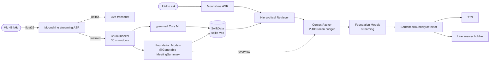
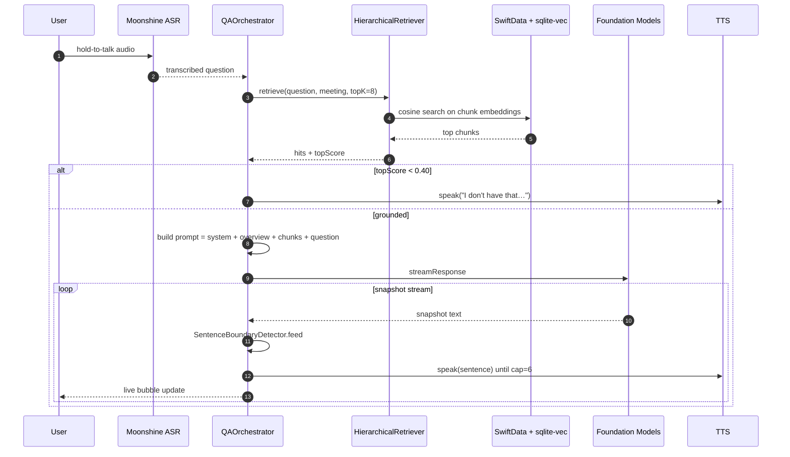
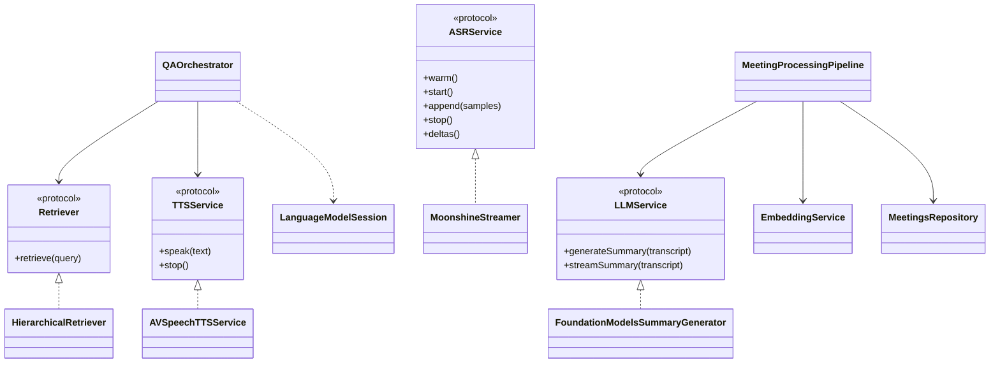

# Aftertalk

> Your meeting, captured and conversational. Fully offline. Nothing leaves the device.

A personal experiment in fully on-device meeting intelligence for iOS 26+. Records a meeting in airplane mode, transcribes locally, generates a structured summary, and lets you ask follow-up questions by voice — every model runs on the iPhone's Neural Engine, no network, no cloud. MIT licensed.

## Status (Day 3 of 7)

End-to-end loop is live on hardware: record → on-device transcript → structured summary → hold-to-talk voice Q&A with grounded streaming answers. Measured on iPhone Air: **TTFT 104 ms, total Q&A turn 1,440 ms.**

| Layer | Pick | Notes |
|---|---|---|
| ASR | Moonshine **medium-streaming-en** (245M, 6.65% WER, 303 MB) | Beats Whisper Large v3 on WER at a fraction of the size |
| LLM | Apple Foundation Models (iOS 26) | 4096-token cap, ~30 tok/s on A18 |
| Embeddings | gte-small Core ML, 384-dim | ~6 MB |
| Vector store | SwiftData + sqlite-vec | One SQLite file, MATCH joins back to typed rows |
| Summary | `@Generable MeetingSummary` (decisions / actions / topics / openQs) | Map-reduce over 7,500-char windows for long meetings |
| Q&A | `QAOrchestrator` — retrieve + summary overview → snapshot stream → sentence detector → TTS | Grounding gate at cosine 0.40, max 6 spoken sentences |
| TTS | `AVSpeechSynthesizer` (placeholder) | Kokoro 82M neural ships Day 4 |

## Architecture



### Q&A turn — sequence



### Component layout



## Day-by-day shipped

**Day 0 — Bootstrap.** Xcode project, SPM dependencies, PRD + architecture docs, daily briefs, repo to GitHub.

**Day 1 — Live ASR.** AVAudioEngine 48 → 16 kHz capture, Moonshine streaming wrapper with single-warm + per-utterance start/stop, debug overlay surfacing TTFT and event counters.

**Day 2 — Summary + RAG.** SwiftData model (Meeting, TranscriptChunk, SpeakerLabel, MeetingSummaryRecord). gte-small Core ML embedding service. sqlite-vec vector store. `@Generable MeetingSummary` over Foundation Models. Chunker with 30 s windows.

**Day 3 — Voice Q&A loop.** Hold-to-talk Moonshine question ASR. Hierarchical retriever. ContextPacker with explicit 2,400-token budget. Grounding gate at cosine 0.40. QAOrchestrator with snapshot streaming → SentenceBoundaryDetector → TTS prefetch. Per-meeting chat thread (ChatThread + ChatMessage). Map-reduce summarization for long meetings (>7,500 chars). Moonshine swap to medium-streaming for 1.2 pp WER improvement. Q&A summary-injection so broad questions read the index instead of guessing from snippets.

## Privacy

Three layers of audit:

1. **Static** — `git grep -n "URLSession\|URLRequest\|http://\|https://" Aftertalk/` returns zero in production paths.
2. **Runtime** — `NWPathMonitor` assertion fires if any interface is up while recording.
3. **Visual** — airplane badge in app chrome turns green only when all interfaces are down.

## Build

```bash
git clone https://github.com/theaayushstha1/aftertalk
cd aftertalk
xcodegen generate
open Aftertalk.xcodeproj
# Plug in iPhone, select as destination, Cmd+R.
```

Models (Moonshine `.ort` files, ~303 MB) are gitignored; populate `Aftertalk/Models/moonshine-medium-streaming-en/` per `Aftertalk/Models/README.md`.

Requirements: Xcode 17+, iOS 26+ device, Apple Developer signing.

## Roadmap

- [x] Day 0 — Bootstrap
- [x] Day 1 — Streaming ASR on device
- [x] Day 2 — Summary + RAG
- [x] Day 3 — Voice Q&A loop with grounding gate
- [ ] Day 4 — Pyannote diarization + Kokoro neural TTS
- [ ] Day 5 — Cross-meeting global chat + TEN-VAD barge-in
- [ ] Day 6 — Polish + MetricKit profiling
- [ ] Day 7 — Demo video + submission

## Acknowledgments

Moonshine ASR — Useful Sensors. FluidAudio — Fluid Inference. gte-small — Alibaba DAMO. sqlite-vec — Alex Garcia.

## License

MIT
