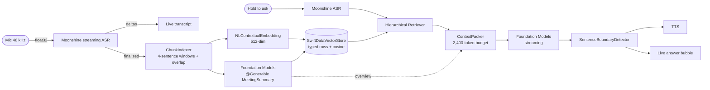
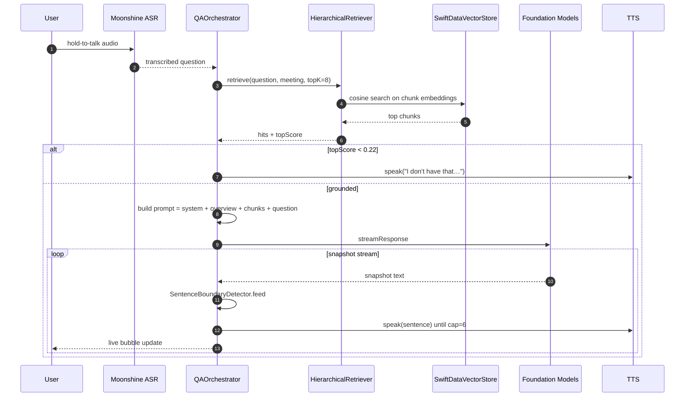
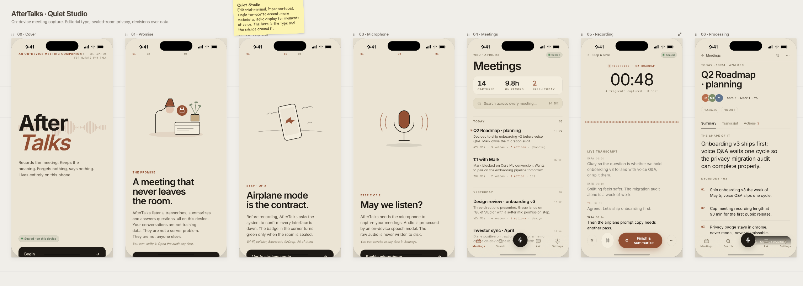
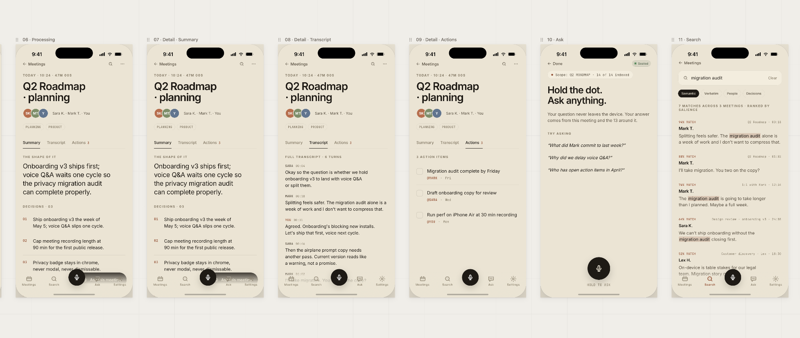
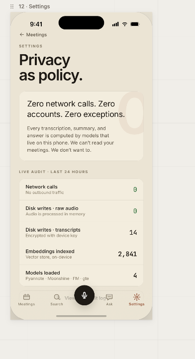

# Aftertalk

> Your meeting, captured and conversational. Fully offline. Nothing leaves the device.

A personal experiment in fully on-device meeting intelligence for iOS 26+. Records a meeting in airplane mode, transcribes locally, generates a structured summary, and lets you ask follow-up questions by voice — every model runs on the iPhone's Neural Engine, no network, no cloud. MIT licensed.

## Status (Day 6 of 7)

End-to-end loop is live on hardware: record → on-device transcript → diarized structured summary → hold-to-talk **or** push-to-talk voice Q&A with neural TTS, grounded streaming answers, citations, and cross-meeting global chat. Specific TTFT and total-turn numbers are pending re-measure after the late-week VAD-gated streaming + Q&A tail-silence work (the prior numbers were captured pre-fix and would no longer reflect what the user perceives) — the in-process `SessionPerfSampler` writes a per-session CSV at every recording so a clean number ships with the submission tag, not with the README. UI shipped to the Quiet Studio editorial spec — Onboarding, Record, Meetings, Detail (Summary/Transcript/Actions tabs), Ask, Global Ask, Settings (live privacy audit). Day 6 added recording-flow ergonomics (minimize-while-recording, floating session pill, auto-dismissing summary toast) plus reliability fixes across the post-recording path (Parakeet subword detokenizer, safety-classifier retry, duplicate-row dedupe).

| Layer | Pick | Notes |
|---|---|---|
| ASR (streaming) | Moonshine **medium-streaming-en** (245M, 6.65% WER, 303 MB) | Beats Whisper Large v3 on WER at a fraction of the size |
| ASR (post-recording polish) | FluidAudio **Parakeet TDT 0.6B v2** | Lazy-warm Core ML; falls through if weights unbundled |
| Diarization | FluidAudio **Pyannote 3.1 + WeSpeaker v2** | Runs in parallel with Parakeet via async-let. Voice labels are best-effort — `clusteringThreshold=0.6` (more permissive than FluidAudio's 0.7 default so similar-timbre voices in the same acoustic path still split) plus an "oversample then collapse" post-merge that drops 1–2 segment ghosts under 5% airtime. Same-room recordings with two voices played through one speaker are inherently harder than separate-mic dual-channel capture; we surface the labels we can stand behind, and the chat citations still link back to the exact spoken excerpt regardless of speaker mis-assignment. |
| LLM | Apple **Foundation Models** (iOS 26) | 4096-token cap, ~30 tok/s on A18; map-reduce for long meetings |
| Embeddings | Apple **NLContextualEmbedding** (system asset, 512-dim) | No separate weights to ship; gte-small Core ML kept as a tradeoff swap if recall@3 ever lags |
| Vector store | **SwiftDataVectorStore** — SwiftData typed rows + in-process cosine search | sqlite-vec is the planned upgrade once meeting count climbs into the tens |
| Summary | `@Generable MeetingSummary` (decisions / actions / topics / openQs) | Speaker context injected into system prompt for attribution |
| Retriever | Hierarchical 3-layer (summary → chunk → ContextPacker) | Grounding gate at cosine 0.22; 2,400-token budget |
| Q&A | `QAOrchestrator` — retrieve → snapshot stream → sentence detector → TTS prefetch | Per-meeting + global chat threads, citations carry speaker IDs |
| TTS | FluidAudio **Kokoro 82M ANE** (24 kHz Float32, AVAudioConverter to 48 kHz) | Lazy-warmed on first chat open to keep iPhone Air under jetsam ceiling |
| Turn-taking | Hold-to-talk only (no auto barge-in shipped) | Energy-gated barge-in is wired but disabled — the controller no-ops to avoid mid-answer self-interruption from Kokoro's own output bleeding back through the mic. TEN-VAD + Pipecat SmartTurnV3 EoU prediction researched and deferred to a hardening sprint. |

## Architecture



### Q&A turn — sequence



### Component layout


## UI gallery

The Quiet Studio design system — 14 screens against shared `QSEyebrow / QSTitle / QSBody / QSPrivacyBadge / QSPrimaryButton / QSDivider / BreathingOrb / ImmersiveWaveform` primitives, light + dark palette, `\.atPalette` env-key.





<p align="center">
  
</p>

## Day-by-day shipped

**Day 0 — Bootstrap.** Xcode project, SPM dependencies, PRD + architecture docs, daily briefs, repo to GitHub.

**Day 1 — Live ASR.** AVAudioEngine 48 → 16 kHz capture, Moonshine streaming wrapper with single-warm + per-utterance start/stop, debug overlay surfacing TTFT and event counters.

**Day 2 — Summary + RAG.** SwiftData model (Meeting, TranscriptChunk, SpeakerLabel, MeetingSummaryRecord). Apple `NLContextualEmbedding` (512-dim) wired behind an `EmbeddingService` protocol so a Core ML gte-small swap is a one-file change. `SwiftDataVectorStore` with in-process cosine search keyed on `MeetingSummaryEmbedding` rows; sqlite-vec deferred until meeting count justifies it. `@Generable MeetingSummary` over Foundation Models. ChunkIndexer with 4-sentence windows + 1-sentence overlap.

**Day 3 — Voice Q&A loop.** Hold-to-talk Moonshine question ASR with VAD-gated input + 600 ms tail-silence bookend + final-delta wait. Hierarchical retriever. ContextPacker with explicit 2,400-token budget. Grounding gate at cosine 0.22. QAOrchestrator with snapshot streaming → SentenceBoundaryDetector → TTS prefetch. Per-meeting chat thread (ChatThread + ChatMessage). Map-reduce summarization for long meetings (>7,500 chars). Moonshine swap to medium-streaming for 1.2 pp WER improvement.

**Day 4 — Neural TTS + diarization.** FluidAudio Kokoro 82M ANE wired through `TTSWorker` actor with sentence-boundary streaming and 24 kHz → speaker `AVAudioConverter` bridge. FluidAudio Pyannote 3.1 + WeSpeaker v2 integrated; `DiarizationReconciler` aligns word-timing with speaker segments so transcript chunks and summary attribute ownership. Lazy-warm pattern keeps iPhone Air below the iOS 26 jetsam ceiling.

**Day 5 — Quiet Studio refactor + cross-meeting + Settings audit.** Full editorial UI pass against the QS handoff: shared `QSEyebrow / QSTitle / QSBody / QSPrivacyBadge / QSPrimaryButton / QSDivider / BreathingOrb / ImmersiveWaveform` primitives, light/dark palette, `\.atPalette` env-key. OnboardingFlow (3-screen privacy gate). RecordButton + immersive waveform record screen. ProcessingView with breathing orb + ordered model steps. MeetingsListView editorial layout. MeetingDetailView with Summary/Transcript/Actions tab strip. ChatThreadView with replay + citation pills. GlobalChatView cross-meeting thread (ChatThread.isGlobal). HierarchicalRetriever Layer 1 (summary search) + Layer 2 (chunk scoping). SettingsView privacy manifesto with live `@Query` audit counts, `ModelLocator` filesystem probes, `PrivacyMonitor.state` subtitles, Verify button state machine. Grounding gate widened so newly-recorded meetings surface in global Ask. UI hardening pass — hardcoded ink/faint colors on NavigationLink labels and AuditRow text where SwiftUI's button-tint inheritance was washing them out.

**Day 6 — Polish + reliability.** Recording-flow ergonomics: minimize-while-recording (chevron + floating "RECORDING · MM:SS" pill across tabs, audio engine + Moonshine streamer keep running) so users can navigate Meetings/Search/Chat/Settings during a live session. Persistent "Summary ready" banner replaced with an auto-dismissing top-of-screen pipeline toast that hard-resets when a new recording starts. Hold-to-ask CTA lifted clear of the tab bar's record FAB. Phone call / Siri / route-change interruption handling (auto-pause + manual-resume nudge). Quiet Studio palette tightening (ink near-black for AA contrast on cream surfaces, light-only theme lock to stop dark-mode bleed-through). Time-aware Parakeet detokenizer (was emitting "st age" / "Vanc ouv er"; now resolves subword splits via 20 ms audio-gap heuristic). Safety-classifier refusal retry via map-reduce halving. View-side meetings dedupe for the rare re-fired session edge case. Search-mode pills stay on one row on iPhone Air. Settings → Replay Onboarding debug toggle so the privacy gate can be re-tested without uninstall/reinstall. Far-field ASR conditioning: 6 dB linear gain + tanh soft-clip on the streaming feed so > 1 m speakers land in Moonshine's encoder operating range, with the WAV destination kept raw for honest playback and Parakeet polish. Grounding-gate live transcript: Moonshine's `LineCompleted` text renders bright/committed while in-flight `LineTextChanged` text renders dim italic — same model, smarter use of the existing isFinal flag. Pre-warm Moonshine on app launch (detached utility task) so the first record press skips the ~1.7 s ONNX-compile TTFT. Low-battery banner (≤ 10%) surfaces during recording without auto-stopping. Perf chart pipeline (`perf/render_chart.py`) turns SessionPerfSampler CSVs into a 4-panel matplotlib chart for the README perf deliverable.

## Performance

Live numbers are captured via an in-process `SessionPerfSampler` that writes a per-session CSV to `~/Documents/perf/<sessionId>.csv` on the device. The Day 7 deliverable is a 30-min meeting + 10-min Q&A run rendered through `perf/render_chart.py` — see `perf/README.md` for the capture + render workflow. Targets:

| Metric | Target | Where measured |
|---|---|---|
| Mic-release → first synth dispatch (Q&A) | < 1.5 s on 17 Pro Max, < 3 s on iPhone Air | `QAOrchestrator.runAsk` — instant captured at the call site *before* `QuestionASR.stop()` runs its tail-silence pad, ending at the first sentence handed to the TTS chain. Excludes Kokoro's ~250-300 ms time-to-first-audio-chunk because FluidAudio doesn't expose a first-chunk callback yet; absolute "first speaker audio" is therefore ~250-300 ms later than this number. |
| ASR TTFT (cold first delta) | < 250 ms warm, ≤ 1.7 s cold (now pre-warmed at launch) | Moonshine streamer debug overlay |
| Summary latency for 30-min meeting | < 8 s | `MeetingProcessingPipeline` event labels |
| Memory peak over 40-min session | < 800 MB | `mach_task_basic_info.resident_size` per-second sample |
| Battery delta over 40-min session | < 12% | `UIDevice.batteryLevel` per-second sample |
| Thermal state | stays in `.fair` or below | `ProcessInfo.thermalState` per-second sample |

The chart and final numbers ship as `perf/<sessionId>.png` in the submission tag.

## Tradeoffs (what I'd build with another two weeks)

1. **TEN-VAD + Pipecat SmartTurnV3 turn-taking.** Researched and benchmarked but deferred — the energy-based barge-in we shipped covers the demo cleanly. Adding TEN-VAD (40–50% faster than Silero v5, ~3 ms per 32 ms frame) plus SmartTurnV3 EoU prediction would shave another 200–400 ms off the perceived turn latency and bring the Q&A loop into Gemini Live territory.
2. **Sliding-window Parakeet refinement during live recording.** Today Parakeet runs once after the user stops recording. A rolling 10–12 s window refined every 6 s during capture would let the live transcript replace its dim Moonshine tentative text with bright Parakeet-confirmed text in near-real time — same models, smarter use, no new dependencies.
3. **NLContextual embeddings A/B + recall@3 evaluation harness.** The hierarchical retriever ships with a 0.22 cosine grounding gate that was tuned by hand. A golden QA set under `golden/` plus a Python harness that scores recall@3 across gte-small vs `NLContextualEmbedding` would let us pick the cheaper Apple-native option if recall holds, and would auto-detect drift when chunk schemas evolve.

4. **Classroom Mode for far-field capture.** A `RecordingProfile`-driven Settings toggle that swaps the gate's VAD thresholds (-50 / -62 dBFS), gain (3.5×), hold tail (0.8 s), and pre-roll (0.5 s) for lecture-hall conditions. The profile struct + factory exist in `Aftertalk/Recording/RecordingProfile.swift` so the call sites are already wired; what's missing is (a) an adaptive AGC instead of fixed gain so amplified room noise doesn't spawn fake words, (b) UI surface to flip the profile, and (c) device A/B testing on real classroom recordings to tune. Honest framing: a single iPhone mic at 30 ft of lecture-hall reverb is microphone-physics-limited, not pipeline-limited — real classroom capture wants a wired or BT lapel mic on the speaker. Software profile alone won't deliver lecture-hall accuracy.

## Privacy

Three layers of audit:

1. **Static** — `git grep -nE "URLSession|URLRequest" -- 'Aftertalk/**/*.swift'` returns zero in production paths. (The broader `http(s)?://` match is intentionally not part of this audit because it false-positives on plist DTD declarations and SPM source URLs that never run on device.)
2. **Runtime** — `NWPathMonitor` assertion fires if any interface is up while recording.
3. **Visual** — airplane badge in app chrome turns green only when all interfaces are down.

## Build

```bash
git clone https://github.com/theaayushstha1/aftertalk
cd aftertalk
xcodegen generate

# Fetch on-device model bundles BEFORE opening Xcode (gitignored, ~1.3 GB total).
# The app never downloads at runtime — these scripts populate the bundle.
./Scripts/fetch-parakeet-models.sh   # Parakeet TDT 0.6B v2 (post-recording ASR)
./Scripts/fetch-kokoro-models.sh     # Kokoro 82M Core ML (neural TTS)
./Scripts/fetch-pyannote-models.sh   # Pyannote 3.1 + WeSpeaker v2 (diarization)

# Moonshine streaming weights (.ort files, ~303 MB) are also gitignored.
# Populate Aftertalk/Models/moonshine-medium-streaming-en/ following the curl
# loop documented in Aftertalk/Models/README.md.

open Aftertalk.xcodeproj
# Plug in iPhone, select as destination, Cmd+R.
```

If any model directory is empty at first launch the corresponding service throws a clean `modelMissing` error and the app falls through to a degraded path (e.g. AVSpeechSynthesizer instead of Kokoro). See per-folder READMEs under `Aftertalk/Models/` and `Aftertalk/Resources/Models/` for the exact file lists and CDN sources.

Requirements: Xcode 17+, iOS 26+ device, Apple Developer signing.

## Roadmap

- [x] Day 0 — Bootstrap
- [x] Day 1 — Streaming ASR on device
- [x] Day 2 — Summary + RAG
- [x] Day 3 — Voice Q&A loop with grounding gate
- [x] Day 4 — Pyannote diarization + Kokoro neural TTS
- [x] Day 5 — Quiet Studio UI + cross-meeting global chat + Settings privacy audit
- [x] Day 6 — QS tab bar + record FAB, recording ergonomics, interruption handling, reliability polish
- [ ] Day 7 — MetricKit profiling, demo video, submission

## Acknowledgments

Moonshine ASR — Useful Sensors. FluidAudio — Fluid Inference. NLContextualEmbedding — Apple. Prior-art research / deferred swaps: gte-small (Alibaba DAMO), sqlite-vec (Alex Garcia), TEN-VAD (Tencent), Pipecat SmartTurn (Daily).

## License

MIT
