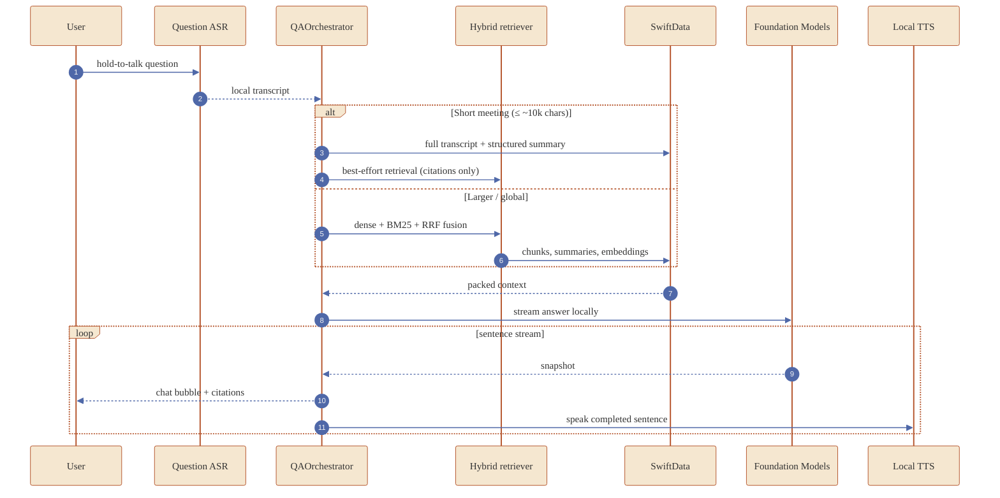

<div align="center">


# Aftertalk

### Meeting memory that never leaves your phone.

<a href="docs/assets/aftertalk-demo.mp4">
  
</a>

<sub><a href="docs/assets/aftertalk-demo.mp4">▶︎ watch the 22-second walkthrough (MP4)</a></sub>

<br />

<!-- Status badges -->

[](https://developer.apple.com/ios/)
[](https://swift.org)
[](https://developer.apple.com/swiftui/)
[](https://developer.apple.com/documentation/FoundationModels)
[](#privacy)
[](LICENSE)
[](#tests)

<br />

<!-- Built-with cluster: clickable links to each upstream -->

[](https://swift.org)
[](https://developer.apple.com/swiftui/)
[](https://developer.apple.com/documentation/SwiftData)
[](https://developer.apple.com/documentation/FoundationModels)
[](https://developer.apple.com/documentation/coreml)
[](https://developer.apple.com/documentation/naturallanguage/nlcontextualembedding)
[](https://github.com/moonshine-ai/moonshine-swift)
[](https://github.com/FluidInference/FluidAudio)
[](https://github.com/pyannote/pyannote-audio)
[](https://github.com/FluidInference/FluidAudio)

<br />

<!-- One-line nav: every section + the long-form docs are one click away -->

[**Demo**](#demo) · [**Architecture**](#architecture) · [**Q&A flow**](#qa-flow) · [**Stack**](#stack) · [**Privacy**](#privacy) · [**Build**](#build) · [**Tests**](#tests) · [**Status**](#status) · [**Decisions**](DECISIONS.md) · [**How it was built**](THOUGHT-PROCESS.md)

</div>

---

## What it does

| **Capture** | **Understand** | **Ask** |
|---|---|---|
| Live Moonshine streaming ASR while you record. | Foundation Models extracts decisions, action items, topics, open questions. | Hold-to-talk Q&A on this meeting **or** all of them. |
| Optional Parakeet polish for word-accurate timing. | NLContextual embeddings + BM25 + RRF for hybrid retrieval. | Streaming answers with citation pills, optional Kokoro TTS. |
| Pyannote diarization for speaker-attributed chunks. | Sentence-aligned chunks indexed in SwiftData on the phone. | Soft grounding gate, full-transcript context for short meetings. |

---

<a id="demo"></a>

## Product tour

<div align="center">

<table>
  <tr>
    <td align="center"><br><sub><b>Record</b></sub></td>
    <td align="center"><br><sub><b>Meetings</b></sub></td>
    <td align="center"><br><sub><b>Summary</b></sub></td>
    <td align="center"><br><sub><b>Transcript</b></sub></td>
  </tr>
  <tr>
    <td align="center"><br><sub><b>Actions</b></sub></td>
    <td align="center"><br><sub><b>Ask</b></sub></td>
    <td align="center"><br><sub><b>Search</b></sub></td>
    <td align="center"><br><sub><b>Global</b></sub></td>
  </tr>
</table>

</div>

---

<a id="architecture"></a>

##  Architecture


<a id="qa-flow"></a>

##  Q&A flow



<a id="stack"></a>

##  Stack

| Layer | Implementation | Notes |
|---|---|---|
| App shell |  SwiftUI · SwiftData · AVAudioEngine | iOS 26+, Swift 6 strict concurrency |
| Live ASR |  **Moonshine small streaming** + EnergyVADGate | Real-time live preview; Parakeet produces the canonical transcript |
| Polish ASR |  FluidAudio **Parakeet TDT 0.6B v2** | Word-accurate timings, ~0.5× real-time |
| Diarization |  FluidAudio Pyannote 3.1 + WeSpeaker v2 | Best-effort labels, `clusteringThreshold=0.5` + ghost-cluster cleanup |
| LLM |  Apple **Foundation Models** | 4096-token context, structured `@Generable` summary |
| Embeddings |  Apple **NLContextualEmbedding** (512-dim) | System asset, no shipped weights |
| Retrieval |  Dense + **BM25** + **Reciprocal Rank Fusion** | Full-transcript path for short meetings |
| Storage |  SwiftData rows + app-local audio files | Cascade delete + repair tool for degraded indexes |
| TTS |  FluidAudio **Kokoro 82M** (ANE) | AVSpeechSynthesizer fallback |

<a id="privacy"></a>

##  Privacy

Aftertalk is built so meeting content never leaves the phone.

| Layer | Guarantee |
|---|---|
| Runtime network | No production `URLSession` or `URLRequest` usage in app Swift sources. |
| Capture | Recording and Q&A run locally once model assets are present. |
| Storage | Audio, transcript, summary, chat, and embeddings are app-local. |
| Verification | Settings includes a live privacy audit and model-asset status. |

```bash
git grep -nE "URLSession|URLRequest" -- 'Aftertalk/**/*.swift'
# returns zero matches in production sources
```

<a id="build"></a>

##  Build

```bash
git clone https://github.com/theaayushstha1/aftertalk
cd aftertalk
xcodegen generate

# Local model bundles (gitignored, downloaded by these scripts)
./Scripts/fetch-parakeet-models.sh
./Scripts/fetch-kokoro-models.sh
./Scripts/fetch-pyannote-models.sh

# Moonshine .ort weights go under
# Aftertalk/Models/moonshine-small-streaming-en/

open Aftertalk.xcodeproj
```

Requirements: Xcode 17+, iOS 26+ device, Apple Developer signing.

<a id="tests"></a>

##  Tests

```bash
xcodebuild test -scheme Aftertalk \
  -destination 'platform=iOS Simulator,name=iPhone 17 Pro'
```

33 tests across 6 suites — VAD gating, sentence boundary detection, title sanitization, diarization cluster cleanup, BM25 tokenization, and RRF fusion. The diarization regression test explicitly encodes the ghost-cluster cycle bug that broke speaker labels under degraded acoustic conditions.

<a id="status"></a>

##  Status

**Shipping**

- Record · live transcript · structured summary · transcript detail · action items · search · per-meeting chat · global chat · Settings privacy audit.
- Q&A avoids the old low-cosine refusal: full-transcript context for short meetings, hybrid dense+BM25+RRF for larger or cross-meeting queries.
- Soft grounding gate refuses only when there are truly no chunks AND no summary on the device.
- Embedding fallback + dim-mismatch filter so degraded indexes can't poison live retrieval.
- Repair tool re-embeds chunks and creates missing summary embeddings when a working embedding service comes back online.
- Optional model assets degrade explicitly with banners instead of silently breaking the recording path.

**Known limits**

- Far-field classrooms are microphone-limited; a phone across a room cannot match a lapel mic near the speaker. The `RecordingProfile.farField` plumbing exists but isn't user-toggleable yet.
- Single-channel diarization labels are best-effort, especially on PC-speaker-played audio or heavy room reverb. FluidAudio's `OfflineDiarizerManager` + VBx is the documented next step.
- Pipeline parallelism. Polish and diarization run concurrently today via `async let`; full background diarization (chunk + summarize from polish alone) is deferred for submission stability.
- Final 30-min + 10-min device perf chart still pending a real-device capture run.

---

##  License

[](LICENSE)

Released under the [MIT License](LICENSE). Use it commercially, fork it, ship it, study it, modify it. The only ask is that the copyright notice and permission text travel with the source. No warranty.

```text
MIT License · Copyright (c) 2026 Aayush Shrestha
```

## Credits

[Moonshine ASR](https://github.com/moonshine-ai/moonshine-swift) by Useful Sensors · [FluidAudio](https://github.com/FluidInference/FluidAudio) by Fluid Inference · Apple Foundation Models · Apple NLContextualEmbedding · [Pyannote](https://github.com/pyannote/pyannote-audio) by Hervé Bredin et al.

---

<div align="center">

<sub>Built in 7 days during finals week by <a href="https://github.com/theaayushstha1">Aayush Shrestha</a>. Read the <a href="DECISIONS.md">architecture decisions</a> or the <a href="THOUGHT-PROCESS.md">day-by-day build log</a> for the full engineering reasoning.</sub>

</div>
